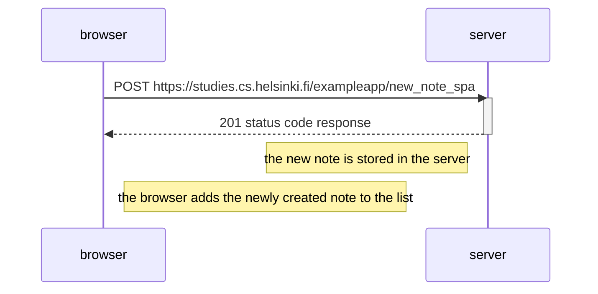

```mermaid
sequenceDiagram
    participant browser
    participant server

    browser->>server: POST https://studies.cs.helsinki.fi/exampleapp/new_note_spa
    activate server
    server-->>browser: 201 status code response
    deactivate server
    
    Note left of server: the new note is stored in the server

    Note right of browser: the browser adds the newly created note to the list


```